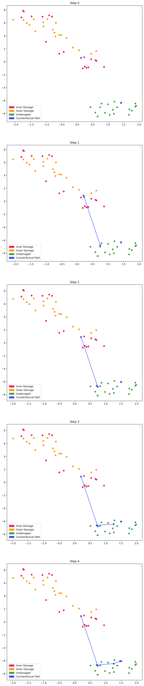

# 011-moving-towards-native-guide

This experiment demonstrates a naive preliminary strategy for counterfactual generation by adopting the [native guide principle](https://doi.org/10.1007/978-3-030-86957-1_3).

### Algorithm Summary

Input:
* Source signal (for which the CF should be generated)
* Target Class

Output:
* A new data point within the target data class including the CF path, showing the stepwise changes induced into the original signal

Distance Computation between signals:
* Throughout the algorithm, measuring the distance is a central aspect.
* It has been shown in experiment `010-radius-feature-descriptor-projection` that the following distance computation yields plausible results: 
  * Compute the sliding window view of the signal
  * Apply [standard scaling](https://scikit-learn.org/stable/modules/generated/sklearn.preprocessing.StandardScaler.html) to the sliding window view, thus moving the average to zero.
  * Compute the l2 norm on each window, which results in the radius per window
  * Compute the histogram of the radii, yielding the radii distribution
  * The histogram is the resulting feature descriptor per signal, which can be compared using the [jensen-shannon divergence measure](https://docs.scipy.org/doc/scipy/reference/generated/scipy.spatial.distance.jensenshannon.html).

Algorithm:
1. Select a native guide, which is the *nearest unlike neighbor*: For each signal in the target class, the distance to the source signal is computed. Then the signal of the target class with the smallest distance to the input signal is chosen.
2. Then stepwise changes are induced to the input signal using the native guide as follows:
   1. Compute the [EMD](https://emd.readthedocs.io/en/stable/) of both input signal and native guide.
   2. Compute possible candidates by swapping IMFs of the input signal with ones from the native guide. Currently, this is done index-wise, so for example IMFs_Input[5] is swapped with IMFs_Native_Guide[5], which is a bit naive and needs to be addressed.
   3. Then the distance of all candidates to the native guide is computed.
   4. The candidate with smalles distance is chosen as the next step.
3. The resulting signal from the step is used for the next step.
4. The procedure is repeated N times (currently user defined).

Result:
Using an incremental TSNE embedding, the following CF path can be observed for a dataset involving damaged and undamaged bearings. The blue star is the native guide of the target class.

The following plots provide the detailed step analysis. A saturated indigo indicates the swapped IMF while pale indigo indicates unchanged IMFs.

### Open Questions and Comments:
* This is not really a "Counterfactual" right now, as it only demonstrates how we can iteratively move towards a signal by inducing changes.
* How can we effectively select IMFs to swap? The index approach is certainly too naive. How can we account for variable IMF counts and unmatching rows?
* How can we evaluate this approach?